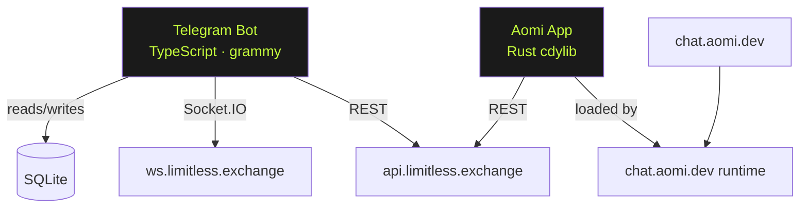

# Limi

**Your edge on Limitless.**

A Telegram bot that keeps prediction market traders ahead of the action on [Limitless Exchange](https://limitless.exchange) — without watching charts all day.

> 📸 _Screenshot placeholder — add after recording demo_

---

## What it does

**Morning brief** — 8am summary of top markets and your open positions, delivered before you've had coffee.

**Market explainer** — `/explain <slug>` gets you a plain-English breakdown of any market: what it resolves on, current odds, liquidity, and when it closes.

**Odds alerts** — `/watch <slug> <threshold>` pings you the moment odds drift past your threshold. You set the number; Limi watches while you're asleep.

---

## Demo

Try it: [@limi\_app\_bot](https://t.me/limi_app_bot)

---

## Architecture



The Telegram bot and the Aomi app are **parallel frontends** over the same Limitless API. They don't talk to each other — both call `api.limitless.exchange` directly. The Aomi app runs inside the chat.aomi.dev LLM agent; the Telegram bot is a standalone Node.js process.

---

## Setup

### Telegram bot

```bash
cd telegram-bot
cp .env.example .env
# fill in TELEGRAM_BOT_TOKEN

npm install
npm run dev          # development (hot-reload)
npm run build && npm start   # production
```

**Environment variables:**

| Variable | Required | Description |
|---|---|---|
| `TELEGRAM_BOT_TOKEN` | ✅ | From [@BotFather](https://t.me/BotFather) |
| `LIMITLESS_API_BASE` | optional | Override API base (default: `https://api.limitless.exchange`) |
| `DB_PATH` | optional | SQLite file path (default: `./limi.db`) |

### Aomi app (chat.aomi.dev)

The Rust crate lives in `aomi-app/` and is deployed via a PR to [aomi-labs/community-apps](https://github.com/aomi-labs/community-apps).

```bash
cd aomi-app
cargo build --release   # must pass before opening PR
cargo clippy -- -D warnings
```

Once the PR is merged and activated by the Aomi team (24–48h), the app is live at `chat.aomi.dev`.

---

## The persona

Meet **Alex** — a part-time prediction market trader with a day job. He has 12 open positions across politics, crypto, and sports markets. He checks Limitless twice a day and doesn't want to miss a significant move while he's in meetings.

Limi is built for Alex. It watches his markets, summarises his portfolio each morning, and explains any market he's curious about — in plain English, not API JSON.

---

## Tech stack

| Layer | Technology |
|---|---|
| Aomi app | Rust, [aomi-sdk](https://github.com/aomi-labs/aomi-sdk) 0.1.19, reqwest |
| Telegram bot | TypeScript 5, [grammy](https://grammy.dev) 1.27, Node 20 |
| Storage | SQLite via better-sqlite3 |
| Scheduling | node-cron |
| Market data | [Limitless Exchange REST API](https://docs.limitless.exchange) |
| Live odds | Limitless WebSocket (Socket.IO) |
| Chain | Base mainnet |

---

## Repo structure

```
limi/
├── aomi-app/           Rust cdylib — deployed to aomi-labs/community-apps
│   ├── Cargo.toml
│   └── src/
│       ├── lib.rs      manifest + preamble + dyn_aomi_app!
│       ├── client.rs   Limitless HTTP helpers
│       └── tool.rs     5 tool implementations
├── telegram-bot/       TypeScript bot
│   ├── src/
│   │   ├── index.ts
│   │   ├── commands/   one file per command
│   │   ├── db/         SQLite schema + helpers
│   │   ├── format.ts   message formatting
│   │   └── limitless/  REST client + WebSocket watcher
│   └── package.json
├── docs/
│   ├── blog-post.md
│   ├── demo-script.md
│   └── branding.md
├── ARCHITECTURE.md
└── HELLO_CI_ANALYSIS.md
```

---

## Links

- Demo bot: [@limi\_app\_bot](https://t.me/limi_app_bot)
- GitHub: [rehna-jp/limi\_bot](https://github.com/rehna-jp/limi_bot)
- Limitless Exchange: [limitless.exchange](https://limitless.exchange)
- Aomi: [chat.aomi.dev](https://chat.aomi.dev)
